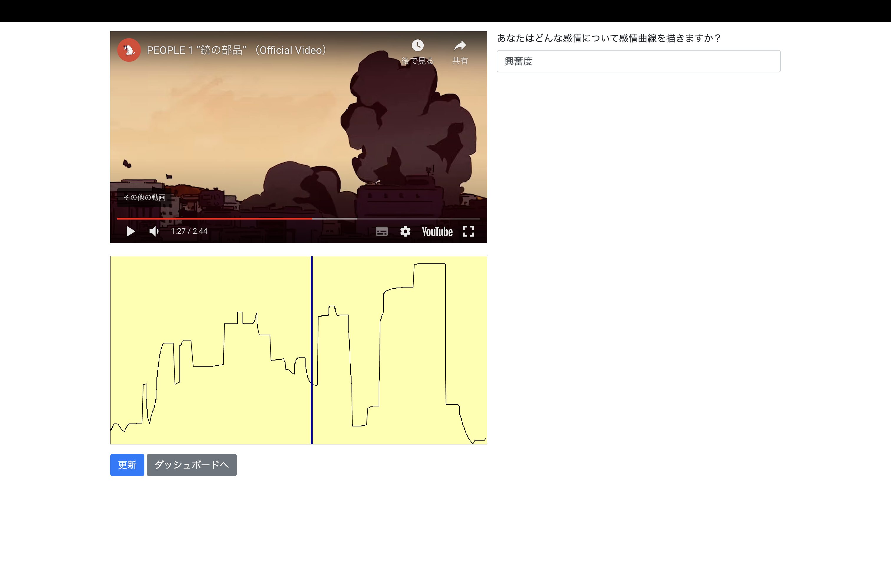

# Frontend of Emonotate: Draw and Collect Emotional Arc

Emonotate brings to draw and collect emotional arcs. 
This is a frontend project for Emonotate.
You need to clone [backend project for Emonotate](https://github.com/tomoya-kwansei/emonotate-backend) if you use.




# Current Features

- [x] Account Management
- [x] 

# Development Overview

## Overall Architecture 
This is a project for Emonotate: support to draw and collect emotional arcs with React.js.

## Setup

Make sure to have the following pre-requisites installed:
1. node 16.x
2. npm 9.4.0
3. Android 8.0+ Phone or Emulation setup

Fork and clone this repository and import into Android Studio
```bash
git clone https://github.com/tomoya-kwansei/emonotate-app/
```

You need to set enviroment variables below:
* REACT_APP_API_URL: Backend URL for Emonotate
* REACT_APP_APP_URL: Frontend URL for Emonotate
* REACT_APP_STAGING: Stage for development `local`, `alpha`, `prod`
* REACT_APP_YOUTUBE_API_KEY: Google Data API Key


Use one of the Android Studio builds to install and run the app in your device or a simulator.

## Starting Developlment Server
> **Warning**
>
> You need to clone [Backend for Emonotate](https://github.com/tomoya-kwansei/emonotate-app) before you use.

## Building
Build the app:
```bash
npm run build
```

## Testing
> **Warning**
>
> Not Implemented

## How to Deploy
You can use Heroku

# Contributing

[Issues](https://github.com/tomoya-kwansei/emonotate-backend/issues) and [pull requests](https://github.com/tomoya-kwansei/emonotate-backend/pulls) are very welcome.

# MIT License

Copyright (c) 2023 Vitor Pamplona

Permission is hereby granted, free of charge, to any person obtaining a copy
of this software and associated documentation files (the "Software"), to deal
in the Software without restriction, including without limitation the rights
to use, copy, modify, merge, publish, distribute, sublicense, and/or sell
copies of the Software, and to permit persons to whom the Software is
furnished to do so, subject to the following conditions:

The above copyright notice and this permission notice shall be included in all
copies or substantial portions of the Software.

THE SOFTWARE IS PROVIDED "AS IS", WITHOUT WARRANTY OF ANY KIND, EXPRESS OR
IMPLIED, INCLUDING BUT NOT LIMITED TO THE WARRANTIES OF MERCHANTABILITY,
FITNESS FOR A PARTICULAR PURPOSE AND NONINFRINGEMENT. IN NO EVENT SHALL THE
AUTHORS OR COPYRIGHT HOLDERS BE LIABLE FOR ANY CLAIM, DAMAGES OR OTHER
LIABILITY, WHETHER IN AN ACTION OF CONTRACT, TORT OR OTHERWISE, ARISING FROM,
OUT OF OR IN CONNECTION WITH THE SOFTWARE OR THE USE OR OTHER DEALINGS IN THE
SOFTWARE.
